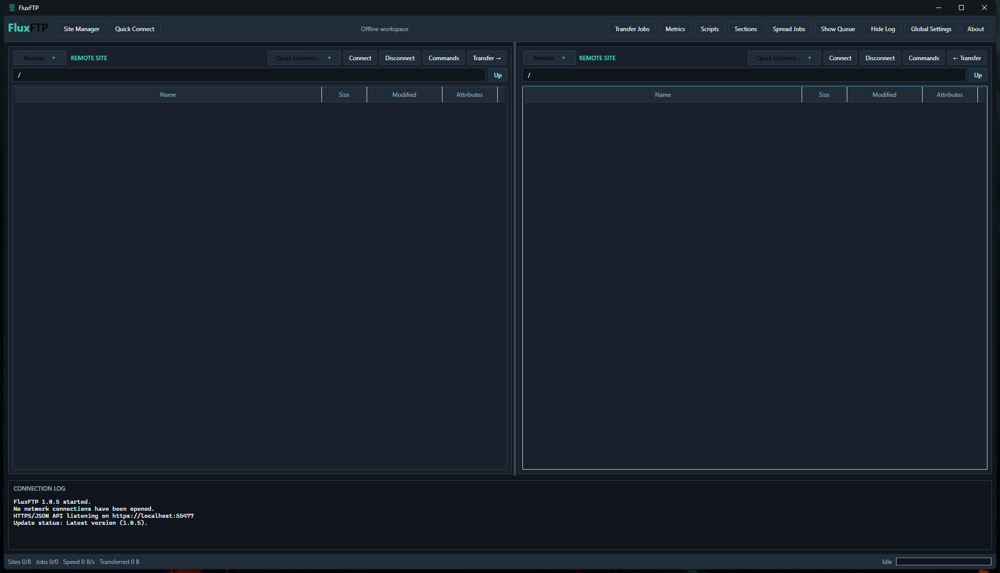
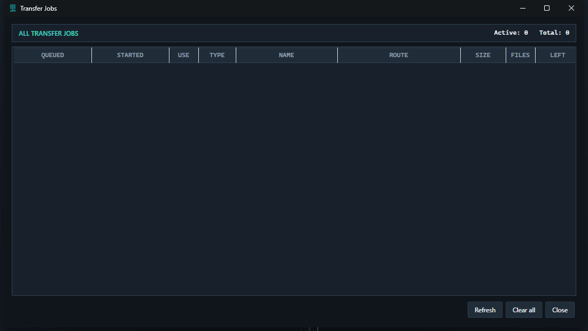
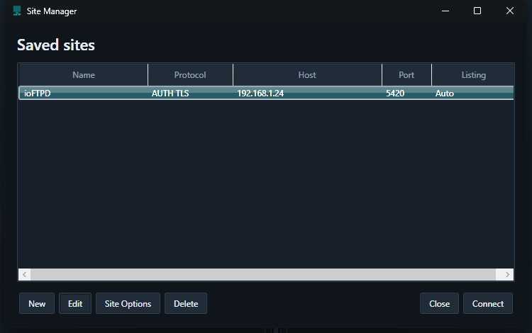
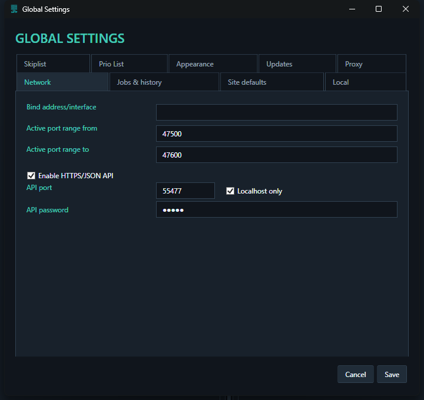

               
# FluxFTP

FluxFTP is a modern dual-pane FTP/FXP client prototype. The first milestone focuses
on the desktop workflow, a persistent transfer queue boundary, and a theme system
with ioGUI3 as the default visual identity.

## Run the prototype

From PowerShell inside the `C:\ioftp` directory:

```powershell
.\run.cmd
```

`run.cmd` can also be launched by double-clicking it. To use the PowerShell
script explicitly, invoke it with the call operator so Windows does not use the
`.ps1` file association:

```powershell
& 'C:\ioftp\run.ps1'
```

The equivalent direct command is:

```powershell
dotnet run --project .\src\IoFtp.Desktop\IoFtp.Desktop.csproj
```

FluxFTP supports FTP/FTPS connections, dual remote sessions, resumable transfers,
and secure FXP with automatic client-relay fallback.

Transfer Queue and Transfer Jobs provide graphical per-file progress bars, queued
and started timestamps, live speed information, and an aggregate activity bar in
the main status area. FluxFTP can also check GitHub Releases for updates at startup
or manually from Global Settings.

Remote folders can be downloaded recursively to either Local pane. FluxFTP creates
the local directory tree and queues each file through the configured reusable
download slots while applying the Skiplist and Priority List.

FluxFTP can minimize and close to the Windows system tray so transfers and API
automation continue in the background. Use **Exit FluxFTP** from the tray menu to
stop the application; an additional warning is shown while the HTTPS/JSON API is active.

## Screenshots

### Dual-pane workspace



| Transfer Jobs | Site Manager |
| --- | --- |
|  |  |

### Global Settings



Saved sites may contain multiple addresses or FTP bouncers in the **Address(es)** field, separated by spaces. FluxFTP tries the first address immediately and starts the remaining attempts after one second. The first successful address is promoted to the front of the saved list for future connections.

## Currently supported FTP commands

FluxFTP sends the following commands automatically when required by browsing, transfers and connection setup:

- Connection and TLS: `USER`, `PASS`, `AUTH TLS`, `PBSZ`, `PROT`, `FEAT`, `TYPE` and `QUIT`
- Navigation and file management: `CWD`, `MKD`, `RMD`, `DELE`, `RNFR`, `RNTO` and `SITE CHMOD`
- Directory and file information: automatic `MLSD` → `LIST` → `STAT -l` fallback, plus `SIZE`
- Data connections and resume: `EPSV`, CEPR address replies, `PASV`, `PORT`, `EPRT` and `REST`
- File transfers: `RETR` and `STOR`
- Secure server-to-server FXP: `CPSV`, `SSCN ON` and `SSCN OFF`
- Distributed FTP servers: `PRET LIST`, `PRET RETR` and `PRET STOR` when **Needs PRET** is enabled for a site
- Multi-file duplicate handling: `SITE XDUPE 3` and X-DUPE `553` reply processing when **Use XDUPE** is enabled

The Commands window currently includes presets for:

- `SITE PRE`, `SITE TAGLINE`, `SITE NFO`, `SITE WHO` and `SITE RULES`
- `SITE REQUESTS`, `SITE SEARCH`, `SITE NUKES`, `SITE NEW` and `SITE HELP`
- `SITE ioGuiExt who` is used internally for ioFTPD FXP speed monitoring

**Load SITE HELP** can add commands advertised by the connected server. FTPRush `RushCmd.xml` command packs can also be imported. The raw-command field accepts one FTP command at a time; credential commands `USER`, `PASS` and `ACCT` are blocked there to avoid exposing or replacing the active login.

## Project boundaries

- `IoFtp.Core`: protocol-neutral connection, browsing and transfer contracts.
- `IoFtp.Desktop`: Windows desktop shell and theme resources.
- `docs`: product scope and architecture decisions.

## Initial milestones

1. Usable dual-pane shell and ioGUI3 theme foundation.
2. Persistent queue and resumable local copy reference implementation.
3. FTP/FTPS transport with capability detection.
4. Server-to-server FXP orchestration.
5. Site profiles and cbftpd-aware commands.
6. SFTP transport as an optional provider.
